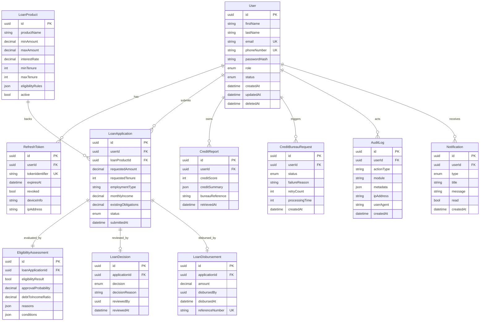

# ER Diagram

```mermaid
erDiagram
  User ||--o{ RefreshToken : has
  User ||--o{ LoanApplication : submits
  User ||--o{ CreditReport : owns
  User ||--o{ CreditBureauRequest : triggers
  User ||--o{ AuditLog : acts
  User ||--o{ Notification : receives

  LoanProduct ||--o{ LoanApplication : backs
  LoanApplication ||--|| EligibilityAssessment : evaluated_by
  LoanApplication ||--o| LoanDecision : reviewed_by
  LoanApplication ||--o| LoanDisbursement : disbursed_by

  User {
    uuid id PK
    string firstName
    string lastName
    string email UK
    string phoneNumber UK
    string passwordHash
    enum role
    enum status
    datetime createdAt
    datetime updatedAt
    datetime deletedAt
  }

  RefreshToken {
    uuid id PK
    uuid userId FK
    string tokenIdentifier UK
    datetime expiresAt
    bool revoked
    string deviceInfo
    string ipAddress
  }

  LoanProduct {
    uuid id PK
    string productName
    decimal minAmount
    decimal maxAmount
    decimal interestRate
    int minTenure
    int maxTenure
    json eligibilityRules
    bool active
  }

  LoanApplication {
    uuid id PK
    uuid userId FK
    uuid loanProductId FK
    decimal requestedAmount
    int requestedTenure
    string employmentType
    decimal monthlyIncome
    decimal existingObligations
    enum status
    datetime submittedAt
  }

  EligibilityAssessment {
    uuid id PK
    uuid loanApplicationId FK
    bool eligibilityResult
    decimal approvalProbability
    decimal debtToIncomeRatio
    json reasons
    json conditions
  }

  CreditReport {
    uuid id PK
    uuid userId FK
    int creditScore
    json creditSummary
    string bureauReference
    datetime retrievedAt
  }

  CreditBureauRequest {
    uuid id PK
    uuid userId FK
    enum status
    string failureReason
    int retryCount
    int processingTime
    datetime createdAt
  }

  LoanDecision {
    uuid id PK
    uuid applicationId FK
    enum decision
    string decisionReason
    uuid reviewedBy
    datetime reviewedAt
  }

  LoanDisbursement {
    uuid id PK
    uuid applicationId FK
    decimal amount
    uuid disbursedBy
    datetime disbursedAt
    string referenceNumber UK
  }

  AuditLog {
    uuid id PK
    uuid userId FK
    string actionType
    string module
    json metadata
    string ipAddress
    string userAgent
    datetime createdAt
  }

  Notification {
    uuid id PK
    uuid userId FK
    enum type
    string title
    string message
    bool read
    datetime createdAt
  }
```
